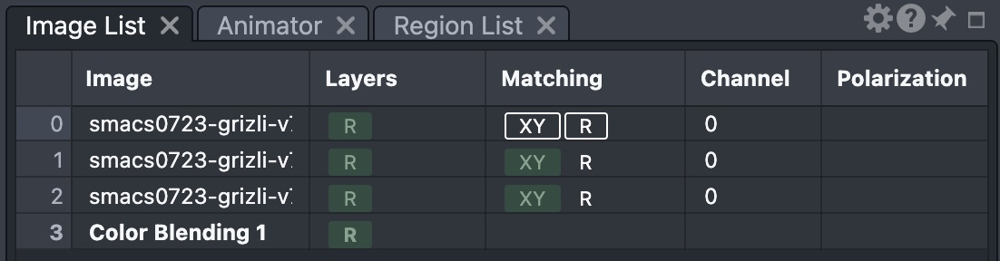

CARTA scripting quick start
===========================

Installation
------------

This package is not yet published on PyPi, but can be installed from a local checkout of the repository.

Requires **Python 3.10** or later. Install with ``pip``:

.. code-block:: shell

    git clone https://github.com/CARTAvis/carta-python.git
    cd carta-python
    pip install .

The required Python library dependencies should be installed automatically. To create new frontend sessions which are controlled by the wrapper instead of connecting to existing frontend sessions, you also need to install the optional browser dependencies:

.. code-block:: shell

    pip install ".[browser]"

You need access either to a CARTA backend executable, on the local host or on a remote host which you can access through SSH, or to a CARTA controller instance (a multi-user system with web-based authentication). You must be able to access the frontend served by this CARTA instance. If you are using your own backend executable, you must start it with the ``--enable_scripting`` commandline parameter to enable the scripting interface.

.. note::
   This version of the wrapper requires CARTA backend, frontend and
   (optionally) controller versions compatible with CARTA 6.0.0 or later.
   Session creation validates the frontend by reading ``frontendVersion``
   through the scripting interface. Only the ``MAJOR.MINOR.PATCH``
   components are compared, so any prerelease suffix (e.g. ``-dev``) is
   accepted as long as the base version meets the minimum. Older
   prerelease builds such as ``6.0.0-beta.1`` do not expose
   ``frontendVersion`` and therefore fail this validation.

If session creation fails during startup validation, check that the frontend
URL is reachable, the session ID is correct, the token is valid, and the
backend was started with ``--enable_scripting``. A failure while reading
``frontendVersion`` can also indicate an unsupported CARTA frontend version.

If you want to create browser sessions from the wrapper, you also need to make sure that your desired browser is installed, together with a corresponding web driver. At present only Chrome (or Chromium) can be used for headless sessions.

Connecting to an existing interactive session
---------------------------------------------

Use the ``interact`` method if you want to use scripting to control a CARTA session which you already have open in your browser.

.. tabs::

    .. tab:: Direct backend access

        .. code-block:: python

            from carta.session import Session
            from carta.token import BackendToken

            session = Session.interact("FRONTEND URL", 123456, BackendToken("SECURITY TOKEN"))

        If you have launched a backend directly, the frontend URL and security token must match your running backend process. You have the option of using an environment variable, ``CARTA_AUTH_TOKEN``, to run CARTA with a fixed security token. Otherwise, a randomly generated token will be printed by the backend when it starts. If you include the security token in the URL, you may omit the security token parameter (it will be parsed from the URL automatically):

        .. code-block:: python

            session = Session.interact("http://HOSTNAME:PORT?token=SECURITY_TOKEN", 123456)

        The second parameter is the session ID, which must match the running frontend session: it's visible when you hover over the status indicator at the top right of the CARTA window in your browser. You can copy it by navigating to ``File > Server > Copy session ID to clipboard``, or find it in the backend executable output.

    .. tab:: Controller access

        To connect to a controller instance, you must authenticate (synchronously) to obtain a controller security token. We recommend using the helper functions provided to save the token to a file and to load it from a file when you use it.

        .. code-block:: python

            from carta.protocol import Protocol

            # Get a refresh token from the controller -- you only have to do this when the token expires
            # You will be prompted securely for a password
            # We recommend not automating this in a way that reveals the password!
            Protocol.request_refresh_token("FRONTEND URL", "USERNAME", "path/to/token")

        This is a long-lived refresh token which will be used automatically to obtain access tokens from the controller as required. You will only have to authenticate again when the long-lived token expires. Token lifetime is configured by the host of the controller.

        Once you have the controller token saved, you can load it when creating session objects:

        .. code-block:: python

            from carta.session import Session
            from carta.token import ControllerToken

            session = Session.interact("FRONTEND URL", 123456, ControllerToken.from_file("path/to/token"))

        The second parameter is the session ID, which must match the running frontend session: it's visible when you hover over the status indicator at the top right of the CARTA window in your browser. You can copy it by navigating to ``File > Server > Copy session ID to clipboard``.

Creating a new interactive session
----------------------------------

.. tabs::

    .. tab:: Direct backend access

        Use the ``start_and_interact`` method if you want to start the backend process from an interactive Python session and connect to the default CARTA session which is automatically opened in your browser on startup.

        This method parses the frontend URL and the session ID from the output of the backend process.

        The wrapper can start the backend process on your local computer, or on a remote host if your Unix user has the appropriate permissions to ssh to the remote host without entering a password.

        .. code-block:: python

            from carta.session import Session

            # New session, start local backend
            session = Session.start_and_interact()

            # New session, start remote backend
            session = Session.start_and_interact(remote_host="REMOTE HOSTNAME OR IP")

    .. tab:: Controller access

        It isn't possible to create a new CARTA session automatically in your default browser using a controller instance. However, you can adapt the instructions below for `creating a new non-interactive session`_ in a browser controlled by the wrapper, and use a custom browser which isn't headless. For example, you can disable the headless option in the built-in Chrome browser configuration with a parameter:

        .. code-block:: python

            session = Session.create(Chrome(headless=False), "FRONTEND URL", ControllerToken.from_file("path/to/token"))

        You can also create a custom :obj:`carta.browser.Browser` object with any appropriate browser executable and driver and any commandline parameters.

Creating a new non-interactive session
--------------------------------------

Use the ``create`` method if you want to write a non-interactive script which starts a new session in a headless browser, performs a series of actions, and saves output, with no input from you. The wrapper automatically parses the session ID from the frontend.

.. tabs::

    .. tab:: Direct backend access

        If you want to connect to an existing backend process, you must provide the frontend URL and the security token. You may omit the token if it is included in the URL.
    
        The ``start_and_create`` method additionally starts a backend process first and parses the frontend URL from the backend output. It can start the backend process on a remote host if your Unix user has the appropriate permissions to ssh to the remote host without entering a password.

        .. code-block:: python

            from carta.session import Session
            from carta.token import BackendToken
            from carta.browser import Chrome

            # New session, connect to an existing backend
            session = Session.create(Chrome(), "FRONTEND URL", BackendToken("SECURITY TOKEN"))

            # New session, start local backend
            session = Session.start_and_create(Chrome())

            # New session, start remote backend
            session = Session.start_and_create(Chrome(), remote_host="REMOTE HOSTNAME OR IP")

    .. tab:: Controller access

        To connect to a controller instance, you must authenticate (synchronously) to obtain a controller security token. We recommend using the helper functions provided to save the token to a file and to load it from a file when you use it.

        .. code-block:: python

            from carta.protocol import Protocol

            # Get a refresh token from the controller -- you only have to do this when the token expires
            # You will be prompted securely for a password
            # We recommend not automating this in a way that reveals the password!
            Protocol.request_refresh_token("FRONTEND URL", "USERNAME", "path/to/token")

        This is a long-lived refresh token which will be used automatically to obtain access tokens from the controller as required. You will only have to authenticate again when the long-lived token expires. Token lifetime is configured by the host of the controller.

        Once you have the controller token saved, you can load it when creating session objects:

        .. code-block:: python

            from carta.session import Session
            from carta.browser import Chrome
            from carta.token import ControllerToken

            # New session, connect to an existing controller
            session = Session.create(Chrome(), "FRONTEND URL", ControllerToken.from_file("path/to/token"))

These commands are further customisable with optional parameters. See :doc:`the API reference <carta>` for more information.

Opening and appending images
----------------------------

Helper methods on the session object open images in the frontend and return image objects which you can use to interact with individual images.

.. code-block:: python

    # Open or append images
    img0 = session.open_image("data/hdf5/first_file.hdf5")
    img1 = session.open_image("data/fits/second_file.fits", append=True)
    img2 = session.open_image("data/fits/third_file.fits", append=True)

    # Open multiple images in one call
    img0, img1, img2 = session.open_images([
        "data/hdf5/first_file.hdf5",
        "data/fits/second_file.fits",
        "data/fits/third_file.fits",
    ])

Inspecting the list of open images
----------------------------------

The session's image list is heterogeneous: it may contain both ordinary frame-backed images (:obj:`carta.image.Image`) and color blending images (:obj:`carta.colorblending.ColorBlending`). Its order matches the image list panel shown in the frontend, as illustrated below.

   The frontend image list panel. Each row corresponds to an item returned by :obj:`carta.session.Session.image_list`, and its position in the list is the item's ``image_view_order``.

.. code-block:: python

    from carta.image import Image
    from carta.colorblending import ColorBlending

    # All open image-view items, in display order
    items = session.image_list()

    # Filter by type if needed
    images = [i for i in items if isinstance(i, Image)]
    color_blendings = [i for i in items if isinstance(i, ColorBlending)]

    # Every image-view item exposes its current image-view order
    print(img0.image_view_order)

    # Retrieve a specific item by image view order
    img = session.image_by_id(image_view_order=0)
    cb = session.image_by_id(image_view_order=1)
        
Changing image properties
-------------------------

Properties specific to individual images can be accessed through image objects:

.. code-block:: python

    import numpy as np
    from carta.constants import Colormap, Scaling, Polarization

    # change the channel and polarization
    img.set_channel(10)
    img.set_polarization(Polarization.Q)
    # various commands for handling spatial and spectral matching are also available

    # pan and zoom
    y, x = img.shape[-2:]
    img.set_center(x/2, y/2)
    img.set_zoom_level(4)

    # change colormap
    img.raster.set_colormap(Colormap.VIRIDIS)
    # more advanced options
    img.raster.set_colormap(Colormap.VIRIDIS, invert=True)
    img.raster.set_scaling(Scaling.LOG, alpha=100)
    img.raster.set_clip(min=-0.5, max=30)

    # add contours
    levels = np.arange(5, 5 * 5, 4)
    img.contours.configure(levels)
    img.contours.apply()
    # use a constant colour
    img.contours.set_color("red")
    # or use a colourmap
    img.contours.set_colormap(Colormap.REDS)
    
Changing session properties
---------------------------

Properties which affect the whole session can be set through the session object:

.. code-block:: python

    from carta.constants import CoordinateSystem, PaletteColor

    # change some WCS overlay properties
    session.wcs.set_view_area(1000, 1000)
    session.wcs.global_.set_coordinate_system(CoordinateSystem.FK5)
    session.wcs.global_.set_color(PaletteColor.RED)
    session.wcs.ticks.set_color(PaletteColor.VIOLET)
    session.wcs.title.show()

Making color blended image
--------------------------

The session object provides two convenience methods which create a color blending image and apply a sensible default colormap set (``RGB`` for three layers or fewer, ``RAINBOW`` for more):

.. code-block:: python

    files = [
        "data/hdf5/first_file.hdf5",
        "data/fits/second_file.fits",
        "data/fits/third_file.fits",
    ]

    # Open the files and combine them into a new color blending image.
    # This closes any currently open images, makes the first opened
    # image the spatial reference, and spatially matches the remaining
    # opened images to it.
    cb = session.open_as_color_blending(files)

    # Create a new color blending from the current spatial reference
    # and its currently spatially matched frames.
    # Set the desired base image as the current spatial reference and
    # enable spatial matching for the other layers first.
    session.clear_spatial_reference()
    img0.make_spatial_reference()
    img1.set_spatial_matching(True)
    img2.set_spatial_matching(True)
    cb = session.create_color_blending()

.. note::
    ``session.open_as_color_blending(files)`` always closes any currently
    open images before opening ``files``. It then makes the first opened
    image the spatial reference and spatially matches the remaining
    opened images to it before creating the color blending.

Manipulate properties of the color blending object and the underlying layers:

.. code-block:: python

    # Get layer objects
    red, green, blue = cb.layer_list()

    # Set colormap for individual layers
    red.set_colormap(Colormap.REDS)
    green.set_colormap(Colormap.GREENS)
    blue.set_colormap(Colormap.BLUES)

    # Or apply an existing colormap set
    cb.set_colormap_set(ColormapSet.RGB)

    # Print the current alpha values of all layers
    print(cb.alpha)

    # Set alpha for individual layers
    red.set_alpha(0.7)
    green.set_alpha(0.8)
    blue.set_alpha(0.9)

    # Or set alpha for all layers at once
    cb.set_alpha([0.7, 0.8, 0.9])

    # Set which layers to keep, and in what order
    # The first layer index must be the base layer (index = 0)
    # Since the base layer cannot be moved,
    # the layers will be reordered as [img0, img2, img1]
    cb.set_layer_sequence([0, 2, 1])

    # Remove the last layer (index = 2)
    cb.delete_layer(2)

    # Add a new layer
    # The layer to be added cannot be one of the current layers
    cb.add_layer(img1)

    # Set center
    cb.set_center(100, 100)

    # Set zoom level
    cb.set_zoom_level(2)

    # Get the current image-view order of the color blending image
    print(cb.image_view_order)

    # Set the color blending object as the active image-view item
    cb.make_active()

    # Set contour visibility
    # This will hide the contours (if any)
    cb.set_contour_visible(False)

    # Close the color blending object
    cb.close()

.. note::
    The base layer (index = 0) cannot be deleted or moved. If you need to
    change the layer order involving the base layer, close the current color
    blending object and create a new one.

Saving or displaying an image
-----------------------------

You can retrieve the encoded image data URI, or the raw decoded data, or save the data to a png file.

The image data can be displayed in a Jupyter notebook:

.. code-block:: python

    from IPython.display import Image

    picture = Image(data=session.rendered_view_data("white"))
    display(picture)

Or an image can be saved to a PNG:

.. code-block:: python

    session.save_rendered_view("my_img.png", "white")
    
.. warning::
    A current known limitation of interactive sessions is that if an image has not finished rendering in the browser when the data is retrieved, you may see a partially rendered image in the scripting interface. We recommend that you use a headless browser for non-interactive scripts, or that you verify that the image has rendered before saving or loading it from an interactive scripting session.
    
Closing images
--------------

.. code-block:: python

    # Close all image-view items open in the session
    for item in session.image_list():
        item.close()
    
Closing the session
-------------------

This will shut down the browser and backend if they were started by the wrapper.

.. code-block:: python

    session.close()
